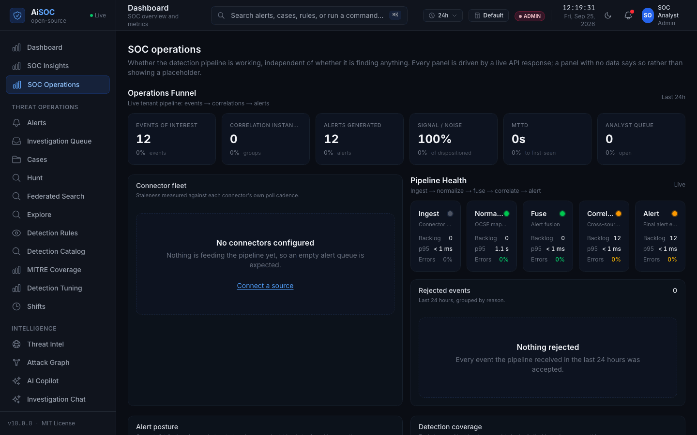

<div align="center">


# AiSOC

**An open-source, self-hostable AI Security Operations Center.** It ingests your security telemetry, detects and correlates threats, investigates them with AI agents whose reasoning is fully auditable, and proposes responses a human approves.

[](https://opensource.org/licenses/MIT) [](CHANGELOG.md) [](https://github.com/beenuar/AiSOC/actions/workflows/ci.yml)
[](https://github.com/beenuar/AiSOC/actions/workflows/codeql.yml) [](https://securityscorecards.dev/viewer/?uri=github.com/beenuar/AiSOC) [](https://github.com/beenuar/AiSOC/blob/main/apps/web/public/papers/aisoc-technical-guide.pdf)

**[Technical Guide (PDF)](https://github.com/beenuar/AiSOC/blob/main/apps/web/public/papers/aisoc-technical-guide.pdf)** · [Docs](https://beenuar.github.io/AiSOC/) · [Architecture](docs/architecture/README.md) · [What actually works](docs/audit/REPOSITORY_REALITY.md) · [Discussions](https://github.com/beenuar/AiSOC/discussions)

</div>

---

## What AiSOC does

Telemetry arrives from your security tools. AiSOC normalizes it, runs the 2603 executable rules of
its 6991-rule library, groups what fires into incidents, investigates each one with an AI agent whose
every prompt and tool call is recorded, and proposes an action. New threat intelligence re-sweeps the
history you already collected, and a human approves before anything reaches a vendor.

## What it looks like running

<a href="apps/web/public/demo/demo.mp4"></a>

**[Watch the full three minutes](apps/web/public/demo/demo.mp4)** — install to AI verdict on one
server against the published images, terminal waits shortened and the recording saying so on screen.
The stills below are earlier runs under the same rules: no seeded rows, no demo mode, no mockups.
([step by step](apps/docs/docs/deployment/walkthrough.mdx) · [what is real](apps/web/public/screenshots/README.md))

| | |
|---|---|
|  |  |
| **Alerts** — each attributed to the connector that fed it. | **Automated triage** — the bundled local model's verdict, confidence and rationale, verbatim. |
|  |  |
| **Threat intelligence** — the real CISA KEV catalog, minutes after boot, with no API key. | **SOC operations** — with nothing connected yet, and it says so rather than showing a placeholder. |

## Quick start

```bash
git clone https://github.com/beenuar/AiSOC && cd AiSOC
make up
```

The [Technical Guide](apps/web/public/papers/aisoc-technical-guide.pdf) covers this in depth —
server sizing, where the model runs, every failure mode with its cause and fix, the REST API, MCP,
and a screenshot of each console surface.

Needs Docker Compose v2 with **8 GB memory and 20 GB free disk in the Docker VM**, plus `python3`
(3.9+) and `bash`; `make doctor` checks all of it and
[Installation](https://beenuar.github.io/AiSOC/docs/installation#requirements) says what each number
was measured against. The first run downloads a ~2 GB model into a volume only `make clean` clears.

`make up` also creates `.env` and generates the **fifteen** secrets in it — the credential vault, the
session signing key, five service-to-service credentials and four datastore passwords — then creates
an administrator and prints its password, generated on your machine, shown once and stored nowhere.
Copy it, or mint another with `make bootstrap ARGS=--reset-password`.

**A port already in use does not stop the install.** AiSOC publishes on a free one, names what held
the old one, and moves the console address with it — measured on a bare clone with 5432 and 11434
both taken, 64 seconds to a signed-in console.

Then **prove it works**. `make smoke` posts one real event to the ingest API and follows it through
Kafka, detection, correlation and Postgres, then reads the alert back out of the public API. Every
stage reports PASS or FAIL:

```
$ make smoke
[PASS] raw telemetry accepted by ingest
[PASS] event traversed the spine and became an alert
[PASS] alert is retrievable by id from the API
PASS: 10/10 stages
```

Sign in at the address `make up` printed. A tenant with nothing connected lands on a **setup
wizard** rather than an all-zero dashboard, and its state is read from your own data so it stays
right if you connect a source through the API. The spec is
[`docs/openapi.yaml`](docs/openapi.yaml) — interactive docs are off in this production-class stack.
Stuck? `make doctor`, which on a host where you have not run `make up` yet says exactly that.

## Try it without connecting anything

Press **Load sample data** in the wizard. Five scenarios take the same ingest path a real connector uses — not inserted rows — so watching them become alerts means watching the pipeline work. They span low to critical on purpose, because a first run where everything is a crisis teaches you nothing about how triage separates signal from routine. They are attributed to `AiSOC` in the source column, refuse to load into a tenant that already has real alerts, and do **not** mark setup complete. ([what each step proves](https://beenuar.github.io/AiSOC/docs/console/getting-started)) For the larger fixed corpus used by demos and evals, `make demo` loads a **synthetic** dataset — the pipeline shape, never a benchmark, a customer or an incident. Every row is `is_synthetic = true` and labelled in the console.

## Connect real data

Push, with a credential from `make ingest-token` (the tenant comes from it, not a header):

```bash
curl -X POST http://localhost:8081/v1/ingest/batch \
  -H 'Content-Type: application/json' -H "Authorization: Bearer $AISOC_INGEST_TOKEN" \
  -d '{"connector_id":"edr-1","connector_type":"crowdstrike","events":[{"severity":"high",
       "title":"Encoded PowerShell from Office","host":"WIN-FIN-01"}]}'
```

Or pull, by configuring one of **84 click-and-connect data connectors** in **Settings → Connectors**
(needs the `full` profile) — Splunk, Sentinel, Elastic, CrowdStrike, Okta, AWS and Kubernetes audit
among those with vendor-specific normalization and setup docs
([coverage](https://beenuar.github.io/AiSOC/docs/connectors/api-coverage)). Without a vendor profile
a connector still ingests through a generic mapping that resolves host, user and source IP.

Bringing existing detections? `packages/aisoc-migrate` translates Splunk SPL, Sentinel KQL and
Elastic EQL, and **refuses rather than approximating** what it cannot carry — an almost-right rule is
harder to find than a missing one. On the 2,005 Splunk rules bundled here, 1,734 translate and 1,711
of those are partial: field matches carried, thresholds did not
([what to do with a partial](apps/docs/docs/migration/from-splunk.md)).

## How it works

Ingest normalizes to a common shape and Kafka carries it, then
fusion runs 2603 executable detection rules, of 6991 on disk, applies **your tenant's own tuning**
on top — the disables, floors and suppressions the console writes, so a rule you turned off actually stops firing — and decides what
becomes an alert. Correlation groups related alerts, an agent investigates and writes its reasoning
to the Investigation Ledger, and a playbook may start from the result. Separately, new threat
intelligence sweeps the lake for sightings you already collected, and a hypothesis becomes a hunt
without anyone writing a query — the model fills a closed schema and every value is bound as a
parameter, so it cannot express a query at all.

**A playbook triggered by an alert previews before it acts.** Three switches must agree — the
deployment, the tenant, the playbook — and every default is off; anything less runs in preview with
its plan attached to the alert. An approval step is a durable pause: the run suspends to Postgres,
survives a restart, resumes after the approval, and expires with a recorded outcome rather than
hanging.

**Executable is earned, not declared.** A rule joins the compiled ruleset only after a vendor-shaped
event is replayed through the real connector and engine and that rule is *watched to fire* — never
inferred from a directory or an `enabled:` flag. The proof can fail: `--prove-gate` reverts the
Windows connector and requires all 1,687 Windows rules to go silent. It means reachable, not that it
detects an attack. 119 still cannot fire, counted by family rather than hidden.
([why 1,362 were refused](docs/detections/sigma-compilation.md))

**Every answer carries its receipts.** The copilot cites each checkable claim to the ledger entry behind
it and labels the rest *uncited* rather than dropping them, and any investigation exports as a **signed
evidence bundle** — byte-identical, prompts as digests, OCSF 1.9.0. ([how](docs/architecture/evidence-bundles.md))

**[docs/architecture/README.md](docs/architecture/README.md)** walks that path one step at a time — eleven
steps, five diagrams, every box linking to the code — and [mirrors to the docs
portal](https://beenuar.github.io/AiSOC/docs/architecture).

## Deployment profiles

| Profile | Command | Services | RAM | What you get |
|---|---|---|---|---|
| **core** | `make up` | 16 | ~8 GB | The full alerting pipeline: ingest → detect → correlate → alert → triage → console, plus the LLM gateway, a local model, the CISA KEV threat feed, and the connector and response services the agent's vendor tools reach |
| **full** | `make up-full` | 22 | ~12 GB | Core plus event lake, entity graph, full-text search, enrichment |
| **demo** | `make up && make demo` | 16 | ~8 GB | Core plus labelled synthetic data |

CORE is the smallest deployment that takes a real event and produces a real alert, and **it needs no
credentials to do either.**

**The model ships with the gateway.** Ollama runs a pinned ~2 GB `llama3.2:3b-instruct-q4_K_M`
sized for CPU-only inference, so `make up` produces real triage verdicts with real token counts in
the Investigation Ledger — not a stub. It is not a frontier model: over 50 alerts it gave triage
usable output 44 times before the reply was constrained to JSON and 50 after
([method](scripts/measure_triage_reliability.py)), and the rail labels which path answered. Run it
faster with `make up-gpu`, `make up-host-llm`, or your own provider from the console
([all four](apps/docs/docs/operations/where-the-model-runs.md)). **No hosted provider has ever been
exercised here** — there is no funded key, so per-model rows read *not measured* rather than zero.
([ADR-0006](docs/decisions/0006-llm-gateway-in-core.md))

**One real external feed ships too.** `services/threatintel` polls the CISA Known Exploited
Vulnerabilities catalog — public, no API key — into the console's Threat Intelligence page: the one
thing in a fresh install that is neither synthetic nor yours.

## Real vs synthetic data

| Kind | Where | How you can tell |
|---|---|---|
| **Real** | Your connectors and the ingest API | `is_synthetic = false` (the default) |
| **Real, and not yours** | The CISA KEV feed on the Threat Intelligence page | Every row carries `source: cisa-kev`; it is the public catalog, unmodified |
| **Sample** | The wizard's **Load sample data** | Source column reads `AiSOC`; RFC 5737 / RFC 2606 reserved addresses only |
| **Demo** | `make demo` | `is_synthetic = true`, labelled in the console |
| **Benchmark / fixtures** | `services/agents/tests/eval_data/`, `**/tests/` | Published rows carry `substrate: true`; fixtures never ship in an image |

**Production never silently falls back to synthetic data.** An unreachable backend makes the console name the failure rather than invent an investigation, and an unmeasured figure reads *not measured*, never `0`. It was not always so: [the reality audit](docs/audit/REPOSITORY_REALITY.md) has each case.

## AI agents

Agents triage alerts and investigate incidents. What they can and cannot do:

- **They read** the alert, its correlated siblings, entity context, and prior verdicts for the same signature.
- **They call typed tools** — lake queries, graph traversals, enrichment lookups. The model picks the tool and passes arguments; it never writes SQL.
- **Everything is logged** to the Investigation Ledger — prompts, tool calls, citations, verdict, token cost — and exports as a signed bundle.
- **Grounding is checked.** A verdict citing an indicator the evidence never contained is demoted to human review rather than auto-closed.
- **A prompt is validated before it is sent.** Raw logs, OCSF payloads and secret-shaped values are refused, not redacted after the fact.
- **No vendor is touched without a human**, unless a tenant has explicitly granted autonomy for that verb. Every response step is graded against its own capability contract at dispatch, so approving a playbook never authorises whatever its steps happen to contain, and an approver must hold the required permission tier and must not be the person who requested the action.

## Project maturity

**Stable is defined, and a gate enforces it.** It was ungated prose until three rows were found describing coverage that did not exist. A row is Stable only with a check that runs on every pull request with no path filter, drives the real production path against real infrastructure, and has a **negative control proven by breaking the thing and watching it go red**. ([the bar](docs/audit/MATURITY_DEFINITION.md))

| Capability | Status | Tested | Production ready |
|---|---|---|---|
| Ingest → detect → correlate → alert | Stable | E2E + unit | Yes |
| Detection engine (2603 executable rules) of 6991 | Stable | Replay proof | Yes |
| Alert correlation into incidents | Stable | Unit | Yes |
| REST API + web console | Stable | Unit + integration | Yes |
| AI triage + Investigation Ledger | Stable | Live Postgres ledger + a PR-gated local-model agent run. No hosted provider has been exercised | Yes, copilot mode |
| Event lake + hunting (ClickHouse) | Stable | Live ClickHouse on the shipped DDL, with a negative control | Yes, `full` profile |
| Retro-hunts when new intel arrives | Stable | Live ClickHouse + Kafka with the flag on, with a negative control | Opt-in, `full` profile |
| 68-hunt YAML library, compiled against tenant events in the lake | Stable | Live ClickHouse: scheduled hunts read tenant data and refuse to fall back to the fixture; all 114 field names the corpus filters on compile, via a lake column or the stored payload | Yes, `full` profile |
| SCIM 2.0, white-label, usage metering | Stable | Live Postgres through the real app, with a negative control | Yes |
| Entity graph (Neo4j) | Stable | Live Neo4j against the production reader, with a negative control | Yes, `full` profile |
| Governed response actions | Stable | Live socket: permits, refuses, never leaks a refusal, with a negative control | Human-approved only |
| Alert-triggered playbooks, with a durable approval pause | Stable | Live Postgres: suspend, restart, resume, expiry, with a negative control | Yes — three opt-ins deep, preview by default |
| Per-tenant detection tuning in the live engine | Stable | Live Postgres: tuning written changes what the engine fires, with a negative control | Yes |
| Scheduled connectors | Stable | Live scheduler polls a stub vendor into ingest, with a negative control | Yes |
| UEBA | Stable | Live Postgres: migrations, scoring, persistence, isolation, with a negative control | Yes, `full` profile |
| Package distribution (npm/PyPI) | Ready, unpublished | `release.yml` builds and packs all eight on every tag | Install from source — the upload is blocked on registry credentials, which is an account action |

## What AiSOC is not

- **Not a drop-in SIEM replacement.** It correlates and investigates; it does not replace long-term log retention and compliance search.
- **Not able to see telemetry you have not connected.** There is no discovery.
- **Not autonomous by default.** Response requires explicit policy authorization and a human approver.
- **Demo and sample incidents are not real incidents**, and benchmark numbers are substrate self-consistency measures, not live agent accuracy — labelled as such wherever published.

## Troubleshooting

`make doctor` checks host tools, memory, disk, every port and each datastore by *querying* it rather than asking whether its container is up, then prints the command to run next. A container killed by a full Docker VM is named as that, not as the service that happened to die.
([the six most common failures](https://beenuar.github.io/AiSOC/docs/installation#the-six-most-common-failures))

## Security

Secrets are generated per deployment and never committed; connector credentials are encrypted at rest. Services connect to Postgres as a DML-only role, so row-level security actually applies, and tenant isolation is enforced at the query layer in every store. RBAC gates every mutating route, ingest is authenticated, and the default install sends no prompt anywhere — the model runs beside it.

SAML and OIDC sign-in with per-connection tenant and group mapping, and SCIM provisioning
([setup](apps/docs/docs/operations/enterprise-sso.md)). Attribute conditions and time-boxed
elevation are schema only: migration 087 creates the tables and no code reads them yet.

**A service with no credential refuses to serve rather than serving unauthenticated.** The [changelog](CHANGELOG.md) records each fix; report via [SECURITY.md](SECURITY.md).

## Developing

```bash
make test        # unit tests for every service
make smoke       # the golden pipeline, against a running stack
make stats       # recount every figure this README publishes
```

Guides: [add a connector](https://beenuar.github.io/AiSOC/docs/plugins/hello-plugin) · [add a detection](https://beenuar.github.io/AiSOC/docs/detections/hello-hunt) · [plugin lifecycle](https://beenuar.github.io/AiSOC/docs/plugins/lifecycle). Every count above is recounted from the tree, and CI fails if this README disagrees.

## Funding · Roadmap · Contributing · License

Development is funded and supported by **[Cyble](https://cyble.com)**, who pay for the engineering time behind AiSOC and release it under the MIT licence rather than keeping it. That buys no special treatment here — no Cyble-only features, no gated modules, no telemetry. ([full credits](.github/CREDITS.md))

[ROADMAP.md](ROADMAP.md) · [CONTRIBUTING.md](CONTRIBUTING.md) · [SECURITY.md](SECURITY.md) · MIT
